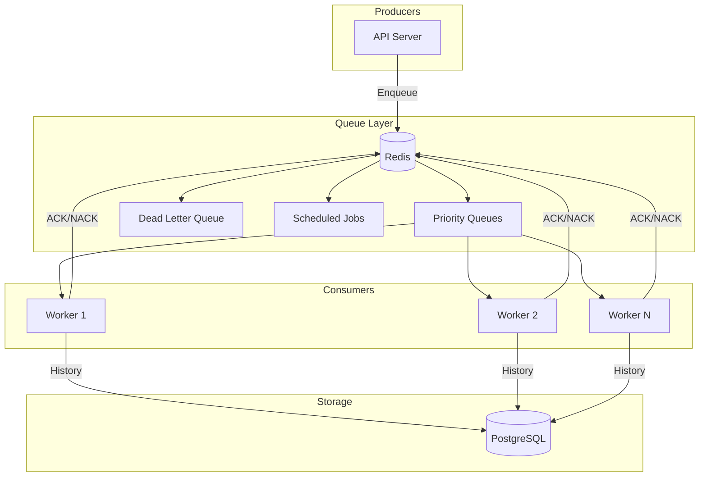

# Fluffy Train (Titan) - Distributed Job Queue System
# IF YOU COME ACROSS THIS, DO NOT USE IT, I DONT RECOMMEND IT. ITS AI GENERATED AND THERE WILL BE ALOT OF VULNERABILITIES. 
[](https://go.dev)
[](LICENSE)

A high-performance, Redis-backed distributed job queue system written in Go. Titan is designed for reliability, scalability, and ease of use.

## Architecture



## Key Features

- **Priority Queues**: 3 priority levels (critical, normal, low)
- **Reliable Processing**: Atomic job claims using Redis LMOVE
- **Automatic Retries**: Exponential backoff with jitter
- **Dead Letter Queue**: Failed jobs preserved for inspection
- **Scheduled Jobs**: Execute jobs at specific times
- **Job Deduplication**: Prevent duplicate job processing
- **Rate Limiting**: Token bucket algorithm (local + distributed)
- **Watchdog**: Recovers stuck/orphaned jobs
- **Graceful Shutdown**: Complete in-flight jobs before exit
- **Panic Recovery**: Handler crashes don't kill workers
- **Structured Logging**: JSON logs with correlation IDs

## Quick Start (< 5 minutes)

### Prerequisites

- Go 1.24+
- Docker and Docker Compose

### 1. Clone and Start Services

```bash
git clone https://github.com/joek3softwares-boop/fluffy-train.git
cd titan

# Start Redis and PostgreSQL
cd deployments
docker-compose up -d redis postgres
cd ..
```

### 2. Run the API Server

```bash
# In a terminal
make run-api
```

### 3. Run a Worker

```bash
# In another terminal
make run-worker
```

### 4. Submit a Job

```bash
curl -X POST http://localhost:8080/api/v1/jobs \
  -H "Content-Type: application/json" \
  -d '{"type": "echo", "payload": {"message": "Hello, Titan!"}}'
```

Response:
```json
{
  "id": "550e8400-e29b-41d4-a716-446655440000",
  "type": "echo",
  "status": "pending",
  "created_at": "2024-01-15T10:30:00Z"
}
```

### 5. Check Job Status

```bash
curl http://localhost:8080/api/v1/jobs/550e8400-e29b-41d4-a716-446655440000
```

## API Reference

### Health Checks

| Endpoint | Method | Description |
|----------|--------|-------------|
| `/health` | GET | Liveness probe (always 200 if running) |
| `/ready` | GET | Readiness probe (checks Redis + Postgres) |

### Jobs

| Endpoint | Method | Description |
|----------|--------|-------------|
| `/api/v1/jobs` | POST | Submit a new job |
| `/api/v1/jobs/batch` | POST | Submit multiple jobs |
| `/api/v1/jobs/{id}` | GET | Get job status |
| `/api/v1/jobs/{id}` | DELETE | Cancel pending job |
| `/api/v1/jobs/{id}/result` | GET | Get completed job result |

### Queue Management

| Endpoint | Method | Description |
|----------|--------|-------------|
| `/api/v1/queues/stats` | GET | Queue statistics |
| `/api/v1/dlq` | GET | List dead letter queue |
| `/api/v1/dlq/{id}/retry` | POST | Retry a dead letter job |

### Example: Submit Job with Options

```bash
curl -X POST http://localhost:8080/api/v1/jobs \
  -H "Content-Type: application/json" \
  -d '{
    "type": "send_email",
    "payload": {"to": "user@example.com", "subject": "Hello"},
    "priority": 10,
    "max_retries": 5,
    "unique_key": "email-user@example.com-welcome",
    "metadata": {"trace_id": "abc123"}
  }'
```

## Configuration

All configuration via environment variables:

| Variable | Default | Description |
|----------|---------|-------------|
| `TITAN_REDIS_HOST` | localhost | Redis host |
| `TITAN_REDIS_PORT` | 6379 | Redis port |
| `TITAN_REDIS_PASSWORD` | (empty) | Redis password |
| `TITAN_REDIS_POOL_SIZE` | 10 | Connection pool size |
| `TITAN_POSTGRES_HOST` | localhost | PostgreSQL host |
| `TITAN_POSTGRES_PORT` | 5432 | PostgreSQL port |
| `TITAN_POSTGRES_USER` | titan | Database user |
| `TITAN_POSTGRES_PASSWORD` | (required) | Database password |
| `TITAN_POSTGRES_DATABASE` | titan | Database name |
| `TITAN_API_PORT` | 8080 | API server port |
| `TITAN_WORKER_CONCURRENCY` | 10 | Worker goroutines |
| `TITAN_LOGGING_LEVEL` | info | Log level (debug/info/warn/error) |
| `TITAN_LOGGING_FORMAT` | json | Log format (json/text) |

## Deployment

### Docker Compose (Development)

```bash
cd deployments
docker-compose up
```

This starts:
- Redis (port 6379)
- PostgreSQL (port 5432)
- 1 API server (port 8080)
- 3 Workers

### Kubernetes (Production)

```bash
# Apply dev overlay
kubectl apply -k deployments/k8s/overlays/dev

# Apply prod overlay
kubectl apply -k deployments/k8s/overlays/prod
```

See [docs/deployment.md](docs/deployment.md) for detailed instructions.

## Performance

Tested on a 3-worker setup with Redis on same network:

| Metric | Value |
|--------|-------|
| Throughput | 10,000+ jobs/minute |
| Submit latency (p95) | < 5ms |
| Processing latency (p95) | < 100ms |
| Memory per worker | ~50MB |

## Design Decisions

See [docs/adr/](docs/adr/) for Architecture Decision Records:

- [ADR-001: Why Redis for Queue](docs/adr/001-redis-for-queue.md)
- [ADR-002: LMOVE over RPOPLPUSH](docs/adr/002-lmove-over-rpoplpush.md)
- [ADR-003: Priority Queue Design](docs/adr/003-priority-queue-design.md)

## Contributing

1. Fork the repository
2. Create a feature branch (`git checkout -b feature/amazing`)
3. Commit changes (`git commit -m 'Add amazing feature'`)
4. Push to branch (`git push origin feature/amazing`)
5. Open a Pull Request

### Development

```bash
# Run tests
make test

# Run linter
make lint

# Build binaries
make build
```

## License

MIT License - see [LICENSE](LICENSE) for details.
